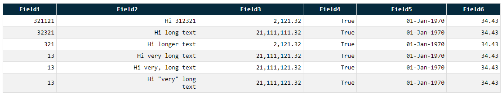
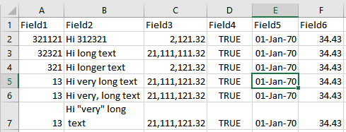

# table.lib

This is a versatile and user-friendly `C# (.NET 8)` table library that can quickly render any `List<T>` or `Dictionary<TV, T>` into a visually appealing `markdown`, `CSV`, `HTML`, `SpecFlow`, `SQL-insert`, or `console` table format, while providing flexibility for other formats as well. In addition, it also supports `dynamic` returns from Dapper as `IEnumerable<IDictionary<string, object>>` via `DBTable` object. Whether you need to format data for documentation, testing, or display purposes, this library makes it easy to do so in a variety of formats, with just a few lines of code.

## Installation

via nuget package -> https://www.nuget.org/packages/table.lib/

```bash
dotnet add package table.lib --version 1.13.0
```

## Markdown format in the `console` output

To make it easier to share, `table.lib` outputs the console output as markdown friendly. Note that there is a specific `markdown` output so the text justification can happen as per markdown specification.

```c#
Table<TestClass>.Add(list).ToConsole();
```

```bash
| Field1 | Field2               | Field3        | Field4 | Field5      | Field6 |
| ------ | -------------------- | ------------- | ------ | ----------- | ------ |
| 321121 | Hi 312321            | 2,121.32      | True   | 01-Jan-1970 | 34.43  |
| 32321  | Hi long text         | 21,111,111.32 | True   | 01-Jan-1970 | 34.43  |
| 321    | Hi longer text       | 2,121.32      | True   | 01-Jan-1970 | 34.43  |
| 13     | Hi very long text    | 21,111,121.32 | True   | 01-Jan-1970 | 34.43  |
| 13     | Hi very, long text   | 21,111,121.32 | True   | 01-Jan-1970 | 34.43  |
| 13     | Hi "very" long  text | 21,111,121.32 | True   | 01-Jan-1970 | 34.43  |
```

| Field1 | Field2               | Field3        | Field4 | Field5      | Field6 |
| ------ | -------------------- | ------------- | ------ | ----------- | ------ |
| 321121 | Hi 312321            | 2,121.32      | True   | 01-Jan-1970 | 34.43  |
| 32321  | Hi long text         | 21,111,111.32 | True   | 01-Jan-1970 | 34.43  |
| 321    | Hi longer text       | 2,121.32      | True   | 01-Jan-1970 | 34.43  |
| 13     | Hi very long text    | 21,111,121.32 | True   | 01-Jan-1970 | 34.43  |
| 13     | Hi very, long text   | 21,111,121.32 | True   | 01-Jan-1970 | 34.43  |
| 13     | Hi "very" long  text | 21,111,121.32 | True   | 01-Jan-1970 | 34.43  |

Considerations:

- Any `CRLF` will be automatically transformed into a space ` ` for an easy representation of the output

## Dynamic Fields

If the List contains another collection of <strings>, the library is able to scan those and build the resultant dataset giving them a column name called `DynamicN`:

```c#
var test = new List<IEnumerable<string>>
{
    new List<string>() {"AAA", "BBB", "CCC"},
    new List<string>() {"AAA", "BBB", "CCC"},
    new List<string>() {"AAA", "BBB", "CCC"},
    new List<string>() {"AAA", "BBB", "CCC"}
};

Table<IEnumerable<string>>.Add(test).ToConsole();
```

```bash
| Capacity | Count | Dynamic0 | Dynamic1 | Dynamic2 |
| -------- | ----- | -------- | -------- | -------- |
| 4        | 3     | AAA      | BBB      | CCC      |
| 4        | 3     | AAA      | BBB      | CCC      |
| 4        | 3     | AAA      | BBB      | CCC      |
| 4        | 3     | AAA      | BBB      | CCC      |
```

| Capacity | Count | Dynamic0 | Dynamic1 | Dynamic2 |
| -------- | ----- | -------- | -------- | -------- |
| 4        | 3     | AAA      | BBB      | CCC      |
| 4        | 3     | AAA      | BBB      | CCC      |
| 4        | 3     | AAA      | BBB      | CCC      |
| 4        | 3     | AAA      | BBB      | CCC      |

## Column Name change

If the name of the column is not of your liking, you can change it via `OverrideColumnsNames` and provide your preferred name. Note that this will also alter the column width to allow for more room if the new name is larger than the previous one.

```c#
Table<IEnumerable<string>>.Add(test)
    .OverrideColumnsNames(new Dictionary<string, string> {{"Dynamic0","ColumnA"}})
    .ToConsole();
```

```bash
| Capacity | Count | ColumnA  | Dynamic1 | Dynamic2 |
| -------- | ----- | -------- | -------- | -------- |
| 4        | 3     | AAA      | BBB      | CCC      |
| 4        | 3     | AAA      | BBB      | CCC      |
| 4        | 3     | AAA      | BBB      | CCC      |
| 4        | 3     | AAA      | BBB      | CCC      |

```

| Capacity | Count | ColumnA  | Dynamic1 | Dynamic2 |
| -------- | ----- | -------- | -------- | -------- |
| 4        | 3     | AAA      | BBB      | CCC      |
| 4        | 3     | AAA      | BBB      | CCC      |
| 4        | 3     | AAA      | BBB      | CCC      |
| 4        | 3     | AAA      | BBB      | CCC      |


## Column filtering

You don't want to show all the columns? Easy, just use the `FilterColumns` property and define the action to perform `FilterAction.Include` or `FilterAction.Exclude`:

By default it will use the `FilterAction.Exclude` functionality:

```c#
Table<IEnumerable<string>>.Add(test)
    .OverrideColumnsNames(new Dictionary<string, string> { { "Dynamic0", "ColumnA" } })
    .FilterColumns(new []{ "Capacity", "Count" })
    .ToConsole();
```

```bash
| ColumnA  | Dynamic1 | Dynamic2 |
| -------- | -------- | -------- |
| AAA      | BBB      | CCC      |
| AAA      | BBB      | CCC      |
| AAA      | BBB      | CCC      |
| AAA      | BBB      | CCC      |
```

| ColumnA  | Dynamic1 | Dynamic2 |
| -------- | -------- | -------- |
| AAA      | BBB      | CCC      |
| AAA      | BBB      | CCC      |
| AAA      | BBB      | CCC      |
| AAA      | BBB      | CCC      |


```c#
Table<IEnumerable<string>>.Add(test)
    .OverrideColumnsNames(new Dictionary<string, string> { { "Dynamic0", "ColumnA" } })
    .FilterColumns(new []{ "Dynamic0" }, FilterActions.Include)
    .ToConsole();
```

```bash
| Dynamic0 |
| -------- |
| AAA      |
| AAA      |
| AAA      |
| AAA      |
```

## Row Highlighter

With a simple operation, we can now highlight the entire content of the table using the code below:

```c#
Table<IEnumerable<string>>.Add(GetStringMatrix())
    .FilterColumns(new[] { "Dynamic0", "Dynamic1" }, FilterAction.Include)
    .HighlightRows(ConsoleColor.Red, ConsoleColor.White)
    .ToConsole();
```

**Note that this option will highlight all the rows


## Field Highlighter

You need more control over the field you want to highlight? then use the highlight operator:

```c#
Table<TestClass>.Add(GetSampleOutput())
    .HighlightValue(new HighlightOperator
        {Field = "Field3", Type = HighlightType.Decimal, DecimalValue = 2121.32m})
    .ToConsole();
```

**Note that this option will highlight one specific cell and it will use two colors, one for `=` and one for `<>`


## Column Justification

You need one of the columns, right aligned or centered? Use the column justification option.

```c#
Table<IEnumerable<string>>.Add(test)
    .OverrideColumnsNames(new Dictionary<string, string>
    {
        { "Dynamic0", "A" },
        { "Dynamic1", "B" },
        { "Dynamic2", "C" }
    })
    .FilterOutColumns(new[] { "Capacity", "Count" })
    .ColumnContentTextJustification(new Dictionary<string, TextJustification>
    {
        { "Dynamic0", TextJustification.Right }, 
        { "Dynamic1", TextJustification.Centered }
    })
    .ToConsole();
```

Note that this will only affect `markdown`, `console` and `html` outputs and only their data. Columns labels will remain left aligned.

```bash
|    A     |    B     |    C     |
| -------- | -------- | -------- |
|      AAA |   BBB    | CCC      |
|      AAA |   BBB    | CCC      |
|      AAA |   BBB    | CCC      |
|      AAA |   BBB    | CCC      |
```

| ColumnA  | Dynamic1 | Dynamic2 |
| -------: | -------- | -------- |
| AAA      | BBB      | CCC      |
| AAA      | BBB      | CCC      |
| AAA      | BBB      | CCC      |
| AAA      | BBB      | CCC      |

## HTML Output

Transform your output into a nicely formatted HTML table

```c#
Table<IEnumerable<string>>.Add(test)
    .OverrideColumnsNames(new Dictionary<string, string> { { "Dynamic0", "ColumnA" } })
    .FilterColumns(new []{ "Capacity", "Count" })
    .ToHtml(@"C:\temp\test.html");

Table<TestClass>.Add(list)
    .ToHtml(@"C:\temp\test-list.html");
```

Sample generated code:

```html
<table style="border-collapse: collapse; width: 100%;">
<tr>
<th style="text-align: center; background-color: #052a3d; color: white;padding: 4px;border: 1px solid #dddddd; font-family:monospace; font-size: 14px;">Field1</th>
<th style="text-align: center; background-color: #052a3d; color: white;padding: 4px;border: 1px solid #dddddd; font-family:monospace; font-size: 14px;">Field2</th>
<th style="text-align: center; background-color: #052a3d; color: white;padding: 4px;border: 1px solid #dddddd; font-family:monospace; font-size: 14px;">Field3</th>
<th style="text-align: center; background-color: #052a3d; color: white;padding: 4px;border: 1px solid #dddddd; font-family:monospace; font-size: 14px;">Field4</th>
<th style="text-align: center; background-color: #052a3d; color: white;padding: 4px;border: 1px solid #dddddd; font-family:monospace; font-size: 14px;">Field5</th>
<th style="text-align: center; background-color: #052a3d; color: white;padding: 4px;border: 1px solid #dddddd; font-family:monospace; font-size: 14px;">Field6</th>
</tr>
<tr>
<td style="text-align: right; color: black; background-color: white;padding: 4px;border: 1px solid #dddddd; font-family:monospace; font-size: 14px;">321121</td>
<td style="text-align: right; color: black; background-color: white;padding: 4px;border: 1px solid #dddddd; font-family:monospace; font-size: 14px;">Hi 312321</td>
<td style="text-align: right; color: black; background-color: white;padding: 4px;border: 1px solid #dddddd; font-family:monospace; font-size: 14px;">2,121.32</td>
<td style="text-align: right; color: black; background-color: white;padding: 4px;border: 1px solid #dddddd; font-family:monospace; font-size: 14px;">True</td>
<td style="text-align: right; color: black; background-color: white;padding: 4px;border: 1px solid #dddddd; font-family:monospace; font-size: 14px;">01-Jan-1970</td>
<td style="text-align: right; color: black; background-color: white;padding: 4px;border: 1px solid #dddddd; font-family:monospace; font-size: 14px;">34.43</td>
</tr>
<tr>
<td style="text-align: right; color: black; background-color: #f2f2f2;padding: 4px;border: 1px solid #dddddd; font-family:monospace; font-size: 14px;">32321</td>
<td style="text-align: right; color: black; background-color: #f2f2f2;padding: 4px;border: 1px solid #dddddd; font-family:monospace; font-size: 14px;">Hi long text</td>
<td style="text-align: right; color: black; background-color: #f2f2f2;padding: 4px;border: 1px solid #dddddd; font-family:monospace; font-size: 14px;">21,111,111.32</td>
<td style="text-align: right; color: black; background-color: #f2f2f2;padding: 4px;border: 1px solid #dddddd; font-family:monospace; font-size: 14px;">True</td>
<td style="text-align: right; color: black; background-color: #f2f2f2;padding: 4px;border: 1px solid #dddddd; font-family:monospace; font-size: 14px;">01-Jan-1970</td>
<td style="text-align: right; color: black; background-color: #f2f2f2;padding: 4px;border: 1px solid #dddddd; font-family:monospace; font-size: 14px;">34.43</td>
</tr>
<tr>
<td style="text-align: right; color: black; background-color: white;padding: 4px;border: 1px solid #dddddd; font-family:monospace; font-size: 14px;">321</td>
<td style="text-align: right; color: black; background-color: white;padding: 4px;border: 1px solid #dddddd; font-family:monospace; font-size: 14px;">Hi longer text</td>
<td style="text-align: right; color: black; background-color: white;padding: 4px;border: 1px solid #dddddd; font-family:monospace; font-size: 14px;">2,121.32</td>
<td style="text-align: right; color: black; background-color: white;padding: 4px;border: 1px solid #dddddd; font-family:monospace; font-size: 14px;">True</td>
<td style="text-align: right; color: black; background-color: white;padding: 4px;border: 1px solid #dddddd; font-family:monospace; font-size: 14px;">01-Jan-1970</td>
<td style="text-align: right; color: black; background-color: white;padding: 4px;border: 1px solid #dddddd; font-family:monospace; font-size: 14px;">34.43</td>
</tr>
<tr>
<td style="text-align: right; color: black; background-color: #f2f2f2;padding: 4px;border: 1px solid #dddddd; font-family:monospace; font-size: 14px;">13</td>
<td style="text-align: right; color: black; background-color: #f2f2f2;padding: 4px;border: 1px solid #dddddd; font-family:monospace; font-size: 14px;">Hi very long text</td>
<td style="text-align: right; color: black; background-color: #f2f2f2;padding: 4px;border: 1px solid #dddddd; font-family:monospace; font-size: 14px;">21,111,121.32</td>
<td style="text-align: right; color: black; background-color: #f2f2f2;padding: 4px;border: 1px solid #dddddd; font-family:monospace; font-size: 14px;">True</td>
<td style="text-align: right; color: black; background-color: #f2f2f2;padding: 4px;border: 1px solid #dddddd; font-family:monospace; font-size: 14px;">01-Jan-1970</td>
<td style="text-align: right; color: black; background-color: #f2f2f2;padding: 4px;border: 1px solid #dddddd; font-family:monospace; font-size: 14px;">34.43</td>
</tr>
<tr>
<td style="text-align: right; color: black; background-color: white;padding: 4px;border: 1px solid #dddddd; font-family:monospace; font-size: 14px;">13</td>
<td style="text-align: right; color: black; background-color: white;padding: 4px;border: 1px solid #dddddd; font-family:monospace; font-size: 14px;">Hi very, long text</td>
<td style="text-align: right; color: black; background-color: white;padding: 4px;border: 1px solid #dddddd; font-family:monospace; font-size: 14px;">21,111,121.32</td>
<td style="text-align: right; color: black; background-color: white;padding: 4px;border: 1px solid #dddddd; font-family:monospace; font-size: 14px;">True</td>
<td style="text-align: right; color: black; background-color: white;padding: 4px;border: 1px solid #dddddd; font-family:monospace; font-size: 14px;">01-Jan-1970</td>
<td style="text-align: right; color: black; background-color: white;padding: 4px;border: 1px solid #dddddd; font-family:monospace; font-size: 14px;">34.43</td>
</tr>
<tr>
<td style="text-align: right; color: black; background-color: #f2f2f2;padding: 4px;border: 1px solid #dddddd; font-family:monospace; font-size: 14px;">13</td>
<td style="text-align: right; color: black; background-color: #f2f2f2;padding: 4px;border: 1px solid #dddddd; font-family:monospace; font-size: 14px;">Hi "very" long<br> text</td>
<td style="text-align: right; color: black; background-color: #f2f2f2;padding: 4px;border: 1px solid #dddddd; font-family:monospace; font-size: 14px;">21,111,121.32</td>
<td style="text-align: right; color: black; background-color: #f2f2f2;padding: 4px;border: 1px solid #dddddd; font-family:monospace; font-size: 14px;">True</td>
<td style="text-align: right; color: black; background-color: #f2f2f2;padding: 4px;border: 1px solid #dddddd; font-family:monospace; font-size: 14px;">01-Jan-1970</td>
<td style="text-align: right; color: black; background-color: #f2f2f2;padding: 4px;border: 1px solid #dddddd; font-family:monospace; font-size: 14px;">34.43</td>
</tr>
</table>
```

Sample output:

<table style="border-collapse: collapse; width: 100%;">
<tr>
<th style="text-align: center; background-color: #052a3d; color: white;padding: 4px;border: 1px solid #dddddd; font-family:monospace; font-size: 14px;">Field1</th>
<th style="text-align: center; background-color: #052a3d; color: white;padding: 4px;border: 1px solid #dddddd; font-family:monospace; font-size: 14px;">Field2</th>
<th style="text-align: center; background-color: #052a3d; color: white;padding: 4px;border: 1px solid #dddddd; font-family:monospace; font-size: 14px;">Field3</th>
<th style="text-align: center; background-color: #052a3d; color: white;padding: 4px;border: 1px solid #dddddd; font-family:monospace; font-size: 14px;">Field4</th>
<th style="text-align: center; background-color: #052a3d; color: white;padding: 4px;border: 1px solid #dddddd; font-family:monospace; font-size: 14px;">Field5</th>
<th style="text-align: center; background-color: #052a3d; color: white;padding: 4px;border: 1px solid #dddddd; font-family:monospace; font-size: 14px;">Field6</th>
</tr>
<tr>
<td style="text-align: right; color: black; background-color: white;padding: 4px;border: 1px solid #dddddd; font-family:monospace; font-size: 14px;">321121</td>
<td style="text-align: right; color: black; background-color: white;padding: 4px;border: 1px solid #dddddd; font-family:monospace; font-size: 14px;">Hi 312321</td>
<td style="text-align: right; color: black; background-color: white;padding: 4px;border: 1px solid #dddddd; font-family:monospace; font-size: 14px;">2,121.32</td>
<td style="text-align: right; color: black; background-color: white;padding: 4px;border: 1px solid #dddddd; font-family:monospace; font-size: 14px;">True</td>
<td style="text-align: right; color: black; background-color: white;padding: 4px;border: 1px solid #dddddd; font-family:monospace; font-size: 14px;">01-Jan-1970</td>
<td style="text-align: right; color: black; background-color: white;padding: 4px;border: 1px solid #dddddd; font-family:monospace; font-size: 14px;">34.43</td>
</tr>
<tr>
<td style="text-align: right; color: black; background-color: #f2f2f2;padding: 4px;border: 1px solid #dddddd; font-family:monospace; font-size: 14px;">32321</td>
<td style="text-align: right; color: black; background-color: #f2f2f2;padding: 4px;border: 1px solid #dddddd; font-family:monospace; font-size: 14px;">Hi long text</td>
<td style="text-align: right; color: black; background-color: #f2f2f2;padding: 4px;border: 1px solid #dddddd; font-family:monospace; font-size: 14px;">21,111,111.32</td>
<td style="text-align: right; color: black; background-color: #f2f2f2;padding: 4px;border: 1px solid #dddddd; font-family:monospace; font-size: 14px;">True</td>
<td style="text-align: right; color: black; background-color: #f2f2f2;padding: 4px;border: 1px solid #dddddd; font-family:monospace; font-size: 14px;">01-Jan-1970</td>
<td style="text-align: right; color: black; background-color: #f2f2f2;padding: 4px;border: 1px solid #dddddd; font-family:monospace; font-size: 14px;">34.43</td>
</tr>
<tr>
<td style="text-align: right; color: black; background-color: white;padding: 4px;border: 1px solid #dddddd; font-family:monospace; font-size: 14px;">321</td>
<td style="text-align: right; color: black; background-color: white;padding: 4px;border: 1px solid #dddddd; font-family:monospace; font-size: 14px;">Hi longer text</td>
<td style="text-align: right; color: black; background-color: white;padding: 4px;border: 1px solid #dddddd; font-family:monospace; font-size: 14px;">2,121.32</td>
<td style="text-align: right; color: black; background-color: white;padding: 4px;border: 1px solid #dddddd; font-family:monospace; font-size: 14px;">True</td>
<td style="text-align: right; color: black; background-color: white;padding: 4px;border: 1px solid #dddddd; font-family:monospace; font-size: 14px;">01-Jan-1970</td>
<td style="text-align: right; color: black; background-color: white;padding: 4px;border: 1px solid #dddddd; font-family:monospace; font-size: 14px;">34.43</td>
</tr>
<tr>
<td style="text-align: right; color: black; background-color: #f2f2f2;padding: 4px;border: 1px solid #dddddd; font-family:monospace; font-size: 14px;">13</td>
<td style="text-align: right; color: black; background-color: #f2f2f2;padding: 4px;border: 1px solid #dddddd; font-family:monospace; font-size: 14px;">Hi very long text</td>
<td style="text-align: right; color: black; background-color: #f2f2f2;padding: 4px;border: 1px solid #dddddd; font-family:monospace; font-size: 14px;">21,111,121.32</td>
<td style="text-align: right; color: black; background-color: #f2f2f2;padding: 4px;border: 1px solid #dddddd; font-family:monospace; font-size: 14px;">True</td>
<td style="text-align: right; color: black; background-color: #f2f2f2;padding: 4px;border: 1px solid #dddddd; font-family:monospace; font-size: 14px;">01-Jan-1970</td>
<td style="text-align: right; color: black; background-color: #f2f2f2;padding: 4px;border: 1px solid #dddddd; font-family:monospace; font-size: 14px;">34.43</td>
</tr>
<tr>
<td style="text-align: right; color: black; background-color: white;padding: 4px;border: 1px solid #dddddd; font-family:monospace; font-size: 14px;">13</td>
<td style="text-align: right; color: black; background-color: white;padding: 4px;border: 1px solid #dddddd; font-family:monospace; font-size: 14px;">Hi very, long text</td>
<td style="text-align: right; color: black; background-color: white;padding: 4px;border: 1px solid #dddddd; font-family:monospace; font-size: 14px;">21,111,121.32</td>
<td style="text-align: right; color: black; background-color: white;padding: 4px;border: 1px solid #dddddd; font-family:monospace; font-size: 14px;">True</td>
<td style="text-align: right; color: black; background-color: white;padding: 4px;border: 1px solid #dddddd; font-family:monospace; font-size: 14px;">01-Jan-1970</td>
<td style="text-align: right; color: black; background-color: white;padding: 4px;border: 1px solid #dddddd; font-family:monospace; font-size: 14px;">34.43</td>
</tr>
<tr>
<td style="text-align: right; color: black; background-color: #f2f2f2;padding: 4px;border: 1px solid #dddddd; font-family:monospace; font-size: 14px;">13</td>
<td style="text-align: right; color: black; background-color: #f2f2f2;padding: 4px;border: 1px solid #dddddd; font-family:monospace; font-size: 14px;">Hi "very" long<br> text</td>
<td style="text-align: right; color: black; background-color: #f2f2f2;padding: 4px;border: 1px solid #dddddd; font-family:monospace; font-size: 14px;">21,111,121.32</td>
<td style="text-align: right; color: black; background-color: #f2f2f2;padding: 4px;border: 1px solid #dddddd; font-family:monospace; font-size: 14px;">True</td>
<td style="text-align: right; color: black; background-color: #f2f2f2;padding: 4px;border: 1px solid #dddddd; font-family:monospace; font-size: 14px;">01-Jan-1970</td>
<td style="text-align: right; color: black; background-color: #f2f2f2;padding: 4px;border: 1px solid #dddddd; font-family:monospace; font-size: 14px;">34.43</td>
</tr>
</table>

Real HTML output:



## CSV Output

Trasform your output into a nicely formatted `CSV` file

```c#
Table<TestClass>.Add(list)
    .ToCsv(@"C:\temp\test-list.csv");
```

The format of the file can be seen here:

```bash
Field1,Field2,Field3,Field4,Field5,Field6
321121,Hi 312321,"2,121.32",True,01-Jan-1970,34.43
32321,Hi long text,"21,111,111.32",True,01-Jan-1970,34.43
321,Hi longer text,"2,121.32",True,01-Jan-1970,34.43
13,Hi very long text,"21,111,121.32",True,01-Jan-1970,34.43
13,"Hi very, long text","21,111,121.32",True,01-Jan-1970,34.43
13,"Hi ""very"" long
 text","21,111,121.32",True,01-Jan-1970,34.43
```

Note that we use the [CSV standard](https://tools.ietf.org/html/rfc4180) when processing `CRLF`, `"` or `,` characters surrouding the value with double quotes. 



## SpecFlow output

Do you deal a lot with SpecFlow tests and want to have something that will generate the output nicely from Dapper? Here it's a simple output:
    
```c#
    var s = Table<TestClass>.Add(GetSampleOutput()).ToSpecFlowString();
    Console.Write(s);
```    
    
and it becomes:
    
```bash
| Id | SenderId | SenderUsername | RecipientId | RecipientUsername | Content | DateRead |     MessageSent     | SenderDeleted | RecipientDeleted |
| 1  | 5        | lilly          | 8           | ruiz              | hi      |          | 08/02/2021 10:07:07 | False         | False            |
| 2  | 5        | lilly          | 8           | ruiz              | hello   |          | 21/02/2021 20:40:08 | False         | False            |    
```    
    
## ToString output

Do you want to render the table somewhere else? Then just use the ToString method and bring the table anywhere with you. This will only produce the `console` output and return it as string.
    
## ToSqlInsertString    

This format will allow you to output a sql string from a specific object like below:

```c#
var s = Table<TestClass>.Add(Samples.GetSampleOutput()).ToSqlInsertString();
            var lines = s.Split(Environment.NewLine);
            Assert.Multiple(() =>
            {
                Assert.That(lines[0], Is.EqualTo("INSERT INTO TestClass (Field1,Field2,Field3,Field4,Field5,Field6) VALUES (321121,'Hi 312321',2121.32,1,'1970-01-01',34.43);"));
                Assert.That(lines[1], Is.EqualTo("INSERT INTO TestClass (Field1,Field2,Field3,Field4,Field5,Field6) VALUES (32321,'Hi long text',21111111.32,1,'1970-01-01',34.43);"));
                Assert.That(lines[2], Is.EqualTo("INSERT INTO TestClass (Field1,Field2,Field3,Field4,Field5,Field6) VALUES (321,'Hi longer text',2121.32,1,'1970-01-01',34.43);"));
                Assert.That(lines[3], Is.EqualTo("INSERT INTO TestClass (Field1,Field2,Field3,Field4,Field5,Field6) VALUES (13,'Hi very long text',21111121.32,1,'1970-01-01',34.43);"));
            });
```
    
# Known Issues

- Simple dictionaries `Dictionary<int, string>` will not work. The second argument needs to be a class.

## Sponsors
No sponsors yet! Will you be the first?

[](https://www.paypal.com/paypalme/jordicorbilla)

### Support me

<a href="https://www.buymeacoffee.com/jordicorbilla" target="_blank"></a>
